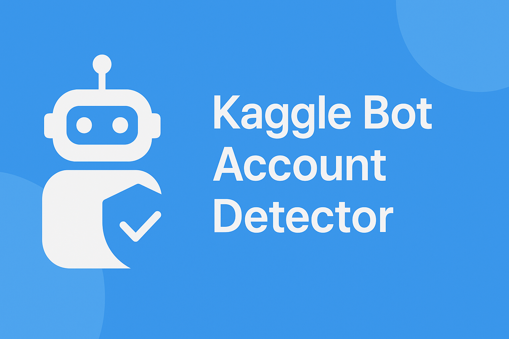
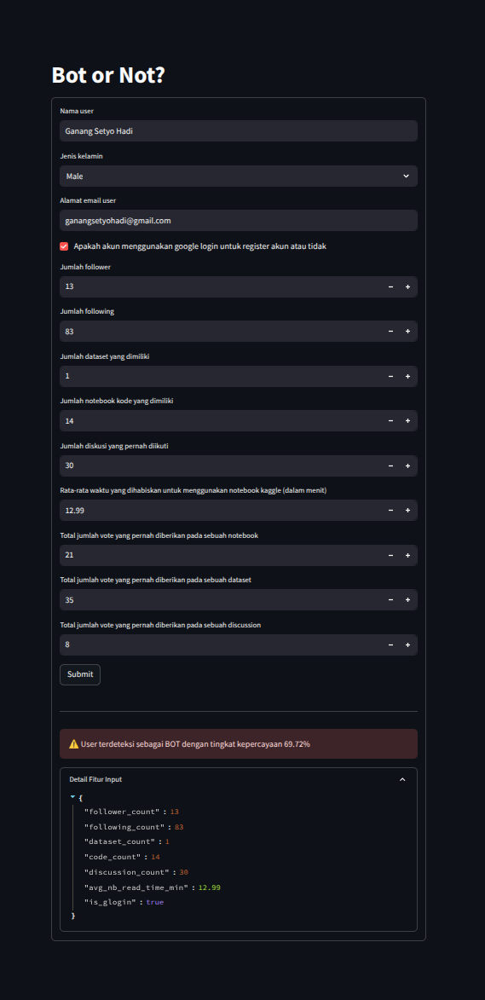

# 🤖 Kaggle Bot Account Detector

[](https://www.python.org/)
[](https://fastapi.tiangolo.com/)
[](https://streamlit.io/)
[](https://xgboost.readthedocs.io/)
[](LICENSE)

A machine learning-based web application that predicts whether a Kaggle account is a bot or a legitimate user based on account features.



## 👥 Team Members

- **Ganang Setyo Hadi** (2208107010052)
- **M. Raza Adzani** (2208107010066)
- **Farah Nashwa** (2208107010051)

Machine Learning Practicum Project, Department of Informatics, Syiah Kuala University

## 📊 Dataset

This project uses the [Kaggle Bot Account Detection](https://www.kaggle.com/datasets/shriyashjagtap/kaggle-bot-account-detection) dataset, which contains features of real and bot accounts on Kaggle. The dataset includes various account attributes such as:

- Follower and following counts
- Dataset and code contributions
- Discussion participation
- Registration information
- Voting patterns
- And more

*Note: The data was generated using the Faker library and is intended for educational purposes.*

## 🧠 Project Overview

Bot accounts present challenges in online platforms by distorting voting patterns, manipulating competition outcomes, and eroding user trust. This project aims to develop an accurate detection system by training machine learning models to identify bot accounts based on behavioral patterns and account characteristics.

## 🏗️ Project Structure

```
.
├── application
│   ├── backend
│   │   ├── __init__.py
│   │   ├── main.py
│   │   └── requirements.txt
│   └── frontend
│       ├── main.py
│       └── requirements.txt
├── dataset
│   └── kaggle_bot_accounts.csv
├── model
│   └── xgboost_model.pkl
└── notebook.ipynb
```

## ✨ Features

- **Comprehensive Data Analysis**: Extensive EDA with visualization of feature distributions and correlations
- **Advanced Preprocessing Pipeline**: Includes handling missing values, scaling, and encoding
- **Robust Model Training**: Implements hyperparameter tuning and cross-validation
- **Ensemble Learning**: Utilizes XGBoost for enhanced prediction accuracy
- **Interactive Web Interface**: User-friendly interface to input account data and receive predictions
- **API Backend**: Fast and efficient API for processing predictions

## 🚀 Implementation Details

### Machine Learning Pipeline

1. **Data Exploration and Cleaning**
   - Exploratory data analysis
   - Handling missing values
   - Feature correlation analysis
   - Outlier detection

2. **Preprocessing**
   - Feature scaling with MinMaxScaler
   - Label encoding for categorical variables
   - Handling imbalanced data with downsampling

3. **Model Training**
   - XGBoost classifier with optimized hyperparameters
   - Cross-validation to ensure model robustness
   - Feature importance analysis

4. **Model Evaluation**
   - Classification report with precision, recall, and F1-score
   - ROC-AUC score
   - Confusion matrix

### Web Application

- **Backend**: FastAPI for efficient API endpoints and data processing
- **Frontend**: Streamlit for intuitive and responsive user interface
- **Integration**: Seamless connection between frontend and model predictions

## 🛠️ Installation and Usage

### Prerequisites

- Python 3.8+
- Pip package manager

### Setup and Installation

1. Clone the repository:
   ```bash
   git clone https://github.com/notsuperganang/kaggle-bot-detector.git
   cd kaggle-bot-detector
   ```

2. Set up the backend:
   ```bash
   cd application/backend
   pip install -r requirements.txt
   ```

3. Set up the frontend:
   ```bash
   cd ../frontend
   pip install -r requirements.txt
   ```

### Running the Application

1. Start the backend server:
   ```bash
   cd application/backend
   uvicorn main:app --reload
   ```

2. In a separate terminal, start the frontend:
   ```bash
   cd application/frontend
   streamlit run main.py
   ```

3. Open your browser and navigate to `http://localhost:8501` to access the application.

## 📸 Screenshots

<p align="center">
  
</p>

## 📋 Model Performance

The XGBoost model achieved:
- Accuracy: ~100%
- Precision: ~100%
- Recall: ~100%
- F1 Score: ~100%
- ROC-AUC: ~100%

## 📌 Future Improvements

- Implement more advanced feature engineering
- Explore additional models and ensemble techniques
- Add user authentication for the web application
- Develop a more detailed dashboard with visualization of prediction results

## 🔗 Links

- [GitHub Repository](https://github.com/notsuperganang/kaggle-bot-detector)
- [Dataset Source](https://www.kaggle.com/datasets/shriyashjagtap/kaggle-bot-account-detection)

## 📜 License

This project is licensed under the MIT License - see the [LICENSE](LICENSE) file for details.

---

*This project was developed as part of the Machine Learning Practicum course at Syiah Kuala University.*